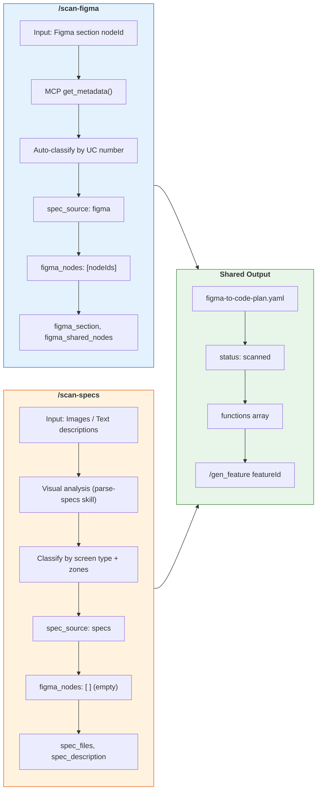

# Flowcharts: scan_figma & scan_specs

---

## 1. /scan-figma Workflow

```mermaid
flowchart TD
    START(["/scan-figma --section nodeId [--feature featureId]"])
    
    %% ===== STEP 1: Parse & Validate =====
    START --> PARSE["<b>STEP 1: Parse Input</b><br/>Extract sectionId from --section<br/>(URL -> regex -> nodeId, or raw nodeId)"]
    PARSE --> CHECK_SECTION{--section<br/>provided?}
    CHECK_SECTION -- No --> STOP_NO_SECTION[/"STOP: Hoi user<br/>cung cap Figma section ID hoac URL"/]
    CHECK_SECTION -- Yes --> CHECK_PLAN{figma-to-code-plan.yaml<br/>exists?}
    
    CHECK_PLAN -- No --> MARK_NEW["Mark: first-time scan<br/>Will create new file at Step 6"]
    CHECK_PLAN -- Yes --> READ_PLAN["Read existing plan YAML"]
    READ_PLAN --> CHECK_SCANNED{Section da<br/>scan truoc do?}
    CHECK_SCANNED -- Yes --> ASK_OVERWRITE{/"Hoi user:<br/>Scan lai (ghi de)?"/}
    ASK_OVERWRITE -- No --> STOP_CANCEL([Cancel])
    ASK_OVERWRITE -- Yes --> CHECK_SPEC_SOURCE
    CHECK_SCANNED -- No --> CHECK_SPEC_SOURCE{Feature co<br/>spec_source: specs?}
    CHECK_SPEC_SOURCE -- Yes --> WARN_HYBRID[/"Canh bao:<br/>Feature da co Specs entry.<br/>Them figma song song?"/]
    CHECK_SPEC_SOURCE -- No --> STEP2
    WARN_HYBRID --> STEP2
    MARK_NEW --> STEP2

    %% ===== STEP 2: MCP get_metadata =====
    STEP2["<b>STEP 2: Call MCP get_metadata(sectionId)</b><br/>Returns XML structure"]
    STEP2 --> PARSE_XML["Parse XML result<br/>Extract level-1 frames ONLY (khong de quy)<br/>Moi frame: nodeId, name, type, childrenCount"]

    %% ===== STEP 3: Auto-Classify =====
    PARSE_XML --> STEP3["<b>STEP 3: Auto-Classify Frames</b>"]
    STEP3 --> CLASSIFY_UC{"Parse UC number<br/>tu ten frame<br/>(regex: UC\s*(\d+))"}
    CLASSIFY_UC --> GROUP_UC["Group frames cung UC number<br/>thanh 1 function<br/>(List view + Form view = 1 function)"]
    CLASSIFY_UC --> GROUP_SHARED["Tab List / Shared components<br/>-> figma_shared_nodes"]

    %% ===== STEP 4: Display Results =====
    GROUP_UC --> STEP4
    GROUP_SHARED --> STEP4
    STEP4["<b>STEP 4: Display Scan Results</b><br/>#  | Node ID | Ten frame | Children<br/>---|---------|-----------|--------"]

    %% ===== STEP 5: User Confirmation =====
    STEP4 --> CHECK_FEATURE{--feature<br/>provided?}
    CHECK_FEATURE -- No --> ASK_FEATURE[/"Hoi user:<br/>Feature ID la gi?<br/>(VD: 2.2)"/]
    ASK_FEATURE --> SHOW_MAPPING
    CHECK_FEATURE -- Yes --> SHOW_MAPPING["Show proposed mapping:<br/>UC X -> function X: Ten chuc nang<br/>  Figma nodes: [nodeIds]"]
    SHOW_MAPPING --> CONFIRM{/"User confirm?<br/>y / n / edit"/}
    CONFIRM -- n --> STOP_CANCEL2([Cancel])
    CONFIRM -- edit --> EDIT_MAPPING["User chinh sua mapping"] --> WRITE_YAML
    CONFIRM -- y --> WRITE_YAML

    %% ===== STEP 6: Write YAML =====
    WRITE_YAML["<b>STEP 6: Write figma-to-code-plan.yaml</b>"]
    WRITE_YAML --> YAML_EXISTS{File<br/>exists?}
    
    YAML_EXISTS -- No --> CREATE_NEW["<b>Create new file:</b><br/>project: name, platform, figma_file<br/>phase_0: status: pending<br/>scanned:<br/>  - feature: featureId<br/>    spec_source: figma<br/>    figma_section: sectionId<br/>    figma_shared_nodes: [...]<br/>    status: scanned<br/>    functions:<br/>      - id, name, figma_nodes<br/>        status: pending"]
    
    YAML_EXISTS -- Yes --> MERGE["<b>Merge/Update:</b><br/>- Feature exists? Update functions<br/>- Feature not exists? Append entry<br/>- DO NOT modify other entries"]

    %% ===== STEP 7: Report =====
    CREATE_NEW --> REPORT
    MERGE --> REPORT
    REPORT["<b>STEP 7: Report</b><br/>Feature: X.X - Ten feature<br/>Section: [nodeId]<br/>Functions found: N<br/>Shared components: M<br/>Plan YAML: updated/created"]
    REPORT --> NEXT_STEP([" Next: /gen_feature featureId"])

    %% ===== Styling =====
    style START fill:#4CAF50,color:#fff
    style STOP_NO_SECTION fill:#f44336,color:#fff
    style STOP_CANCEL fill:#f44336,color:#fff
    style STOP_CANCEL2 fill:#f44336,color:#fff
    style NEXT_STEP fill:#2196F3,color:#fff
    style STEP2 fill:#FF9800,color:#fff
    style STEP3 fill:#9C27B0,color:#fff
    style STEP4 fill:#009688,color:#fff
    style WRITE_YAML fill:#3F51B5,color:#fff
    style REPORT fill:#607D8B,color:#fff
    style WARN_HYBRID fill:#FFC107,color:#000
    style CREATE_NEW fill:#1565C0,color:#fff
    style MERGE fill:#1565C0,color:#fff
```

---

## 2. /scan-specs Workflow

```mermaid
flowchart TD
    START(["/scan-specs --feature featureId<br/>[--image path] [--name name]"])

    %% ===== STEP 1: Parse & Validate =====
    START --> PARSE["<b>STEP 1: Parse Input</b><br/>Extract featureId, image paths, name"]
    PARSE --> CHECK_FEATURE{--feature<br/>provided?}
    CHECK_FEATURE -- No --> STOP_NO_FEATURE[/"STOP: Hoi user<br/>cung cap feature ID"/]
    CHECK_FEATURE -- Yes --> CHECK_INPUT{Co image<br/>hoac text?}
    CHECK_INPUT -- No --> STOP_NO_INPUT[/"STOP: Hoi user<br/>paste anh hoac mo ta text"/]
    CHECK_INPUT -- Yes --> CHECK_PLAN{figma-to-code-plan.yaml<br/>exists?}

    CHECK_PLAN -- No --> MARK_NEW["Mark: first-time scan"]
    CHECK_PLAN -- Yes --> READ_PLAN["Read existing plan YAML"]
    READ_PLAN --> CHECK_EXISTING{Feature da<br/>scan truoc do?}
    CHECK_EXISTING -- Yes --> ASK_RESCAN{/"Hoi user:<br/>Scan lai (ghi de)?"/}
    ASK_RESCAN -- No --> STOP_CANCEL([Cancel])
    ASK_RESCAN -- Yes --> CHECK_FIGMA_SOURCE
    CHECK_EXISTING -- No --> CHECK_FIGMA_SOURCE{Feature co<br/>spec_source: figma?}
    CHECK_FIGMA_SOURCE -- Yes --> WARN_HYBRID[/"Canh bao:<br/>Feature da co Figma entry.<br/>Them specs song song?"/]
    CHECK_FIGMA_SOURCE -- No --> STEP2
    WARN_HYBRID --> STEP2
    MARK_NEW --> STEP2

    %% ===== STEP 2: Gather Specs =====
    STEP2["<b>STEP 2: Gather Specs</b>"]
    STEP2 --> GATHER_IMG["Read image files tu disk<br/>(--image paths)"]
    STEP2 --> GATHER_PASTE["Extract pasted images<br/>tu chat"]
    STEP2 --> GATHER_TEXT["Parse text descriptions<br/>tu user input"]
    GATHER_IMG --> STEP3
    GATHER_PASTE --> STEP3
    GATHER_TEXT --> STEP3

    %% ===== STEP 3: Analyze Specs =====
    STEP3["<b>STEP 3: Analyze Specs</b><br/>(via parse-specs skill)"]
    STEP3 --> CLASSIFY["Classify screen type:<br/>list | detail | form | dialog | tab | bottom-sheet"]
    CLASSIFY --> ZONES["Map UI zones:<br/>[Zone: Header] - NavigationBar, title<br/>[Zone: Body] - Cards, Lists, Inputs<br/>[Zone: Footer] - Buttons, TabBar"]
    ZONES --> COMPONENTS["Identify components:<br/>Search, Tabs, Card, Button,<br/>Badge, Input, etc."]
    COMPONENTS --> GROUPING["Grouping logic:<br/>- Multi-image same flow = 1 function<br/>- Tab variants = 1 function<br/>- Different screens = separate functions<br/>- Modals = sub-functions"]
    GROUPING --> BUILD_DESC["Build spec_description:<br/>[Zone: Header]<br/>  - NavigationBar: title<br/>[Zone: Body]<br/>  - Card (repeat): thumb, title<br/>[Zone: Footer]<br/>  - Button: 'Submit'"]

    %% ===== STEP 4: Display Results =====
    BUILD_DESC --> STEP4["<b>STEP 4: Display Results Table</b><br/># | Function ID | Name | Source | Screen Type"]

    %% ===== STEP 5: User Confirmation =====
    STEP4 --> SHOW_MAPPING["Show proposed mapping:<br/>Function 1: Ten man hinh<br/>  Type: list, Source: image_1.png<br/>  spec_description: [zones...]"]
    SHOW_MAPPING --> CONFIRM{/"User confirm?<br/>y / n / edit"/}
    CONFIRM -- n --> STOP_CANCEL2([Cancel])
    CONFIRM -- edit --> EDIT_MAPPING["User chinh sua mapping"] --> WRITE_YAML
    CONFIRM -- y --> WRITE_YAML

    %% ===== STEP 6: Write YAML =====
    WRITE_YAML["<b>STEP 6: Write figma-to-code-plan.yaml</b>"]
    WRITE_YAML --> YAML_EXISTS{File<br/>exists?}

    YAML_EXISTS -- No --> CREATE_NEW["<b>Create new file:</b><br/>project: name, platform<br/>phase_0: status: pending<br/>scanned:<br/>  - feature: featureId<br/>    spec_source: specs<br/>    spec_files: [image paths]<br/>    spec_notes: ...<br/>    status: scanned<br/>    functions:<br/>      - id, name<br/>        figma_nodes: [ ]<br/>        spec_description: [zones]<br/>        status: scanned"]

    YAML_EXISTS -- Yes --> MERGE["<b>Merge/Update:</b><br/>- Feature exists? Update functions<br/>- Feature not exists? Append entry<br/>- DO NOT modify other entries"]

    %% ===== STEP 7: Report =====
    CREATE_NEW --> REPORT
    MERGE --> REPORT
    REPORT["<b>STEP 7: Report</b><br/>Feature: X.X - Ten feature<br/>Spec files: N images<br/>Functions found: M<br/>Plan YAML: updated/created"]
    REPORT --> NEXT_STEP(["Next: /gen_feature featureId"])

    %% ===== Styling =====
    style START fill:#4CAF50,color:#fff
    style STOP_NO_FEATURE fill:#f44336,color:#fff
    style STOP_NO_INPUT fill:#f44336,color:#fff
    style STOP_CANCEL fill:#f44336,color:#fff
    style STOP_CANCEL2 fill:#f44336,color:#fff
    style NEXT_STEP fill:#2196F3,color:#fff
    style STEP2 fill:#FF9800,color:#fff
    style STEP3 fill:#9C27B0,color:#fff
    style STEP4 fill:#009688,color:#fff
    style WRITE_YAML fill:#3F51B5,color:#fff
    style REPORT fill:#607D8B,color:#fff
    style WARN_HYBRID fill:#FFC107,color:#000
    style CREATE_NEW fill:#1565C0,color:#fff
    style MERGE fill:#1565C0,color:#fff
```

---

## 3. So sanh 2 Workflows



---

## 4. Skills & Dependencies

```mermaid
flowchart TB
    subgraph WORKFLOWS["Workflows"]
        SF["/scan-figma"]
        SS["/scan-specs"]
        GF["/gen-feature"]
        GM["/gen-module"]
        UF["/update-feature"]
        UM["/update-module"]
        IDS["/init-design-system"]
        IFL["/init-feature-list"]
    end

    subgraph SKILLS["Skills"]
        RF["read-figma<br/>(MCP interface)"]
        SP["scan-spec<br/>(parse-specs)"]
        DFC["diff-figma-code"]
        EDT["extract-design-tokens"]
        GRS["gen-rn-screen"]
        PFI["parse-feature-input"]
        PFR["parse-feature-ref"]
        UP["update-plan"]
    end

    subgraph MCP["MCP Tools (Figma)"]
        GM1["get_metadata"]
        GDC["get_design_context"]
        GS["get_screenshot"]
        GVD["get_variable_defs"]
        CDSR["create_design_system_rules"]
    end

    subgraph OUTPUT["Output"]
        YAML["figma-to-code-plan.yaml"]
        CODE["app/src/screens/*.tsx"]
        THEME["app/src/theme/*"]
    end

    %% scan-figma dependencies
    SF -->|"Step 2"| RF
    RF --> GM1
    SF -->|"Step 6"| UP
    UP --> YAML

    %% scan-specs dependencies
    SS -->|"Step 3"| SP
    SS -->|"Step 6"| UP

    %% gen-feature dependencies
    GF -->|"lookup"| PFR
    PFR --> YAML
    GF -->|"figma source"| RF
    RF --> GDC
    RF --> GS
    GF -->|"gen code"| GRS
    GRS --> CODE
    GF -->|"update status"| UP

    %% gen-module calls gen-feature
    GM -->|"for each feature"| GF

    %% update-feature dependencies
    UF -->|"figma source"| RF
    UF -->|"diff"| DFC
    DFC --> CODE
    UF -->|"update status"| UP

    %% update-module calls update-feature
    UM -->|"for each feature"| UF

    %% init-design-system dependencies
    IDS -->|"tokens"| EDT
    EDT --> GVD
    EDT --> CDSR
    EDT --> THEME
    IDS -->|"update phase_0"| UP

    %% init-feature-list
    IFL --> PFI

    style SF fill:#1565C0,color:#fff
    style SS fill:#E65100,color:#fff
    style GF fill:#2E7D32,color:#fff
    style GM fill:#2E7D32,color:#fff
    style UF fill:#6A1B9A,color:#fff
    style UM fill:#6A1B9A,color:#fff
    style IDS fill:#F57F17,color:#fff
    style YAML fill:#C62828,color:#fff
    style CODE fill:#00695C,color:#fff
    style THEME fill:#AD1457,color:#fff
```


